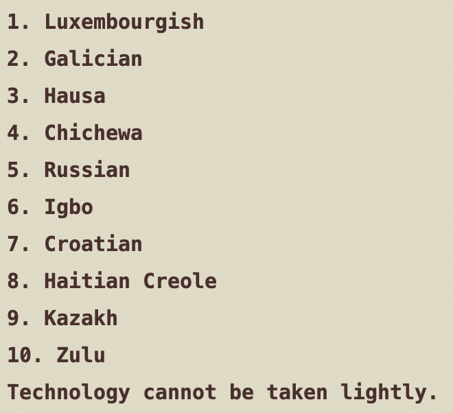
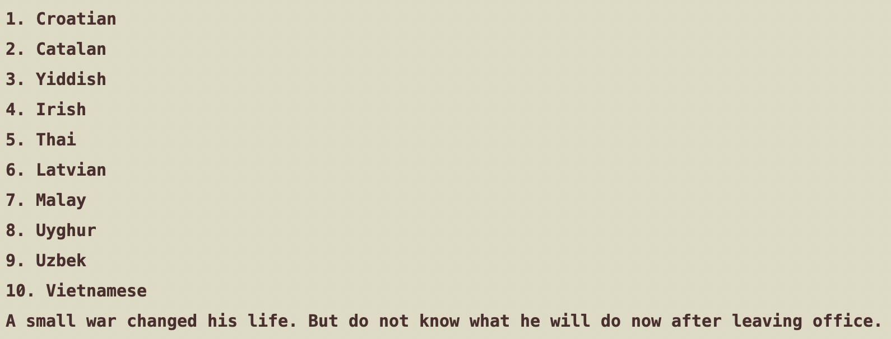
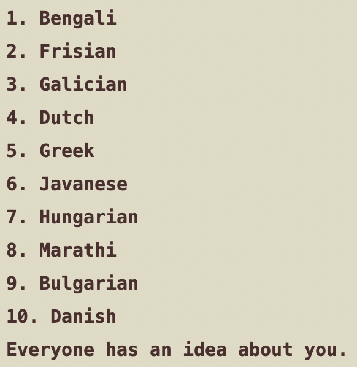
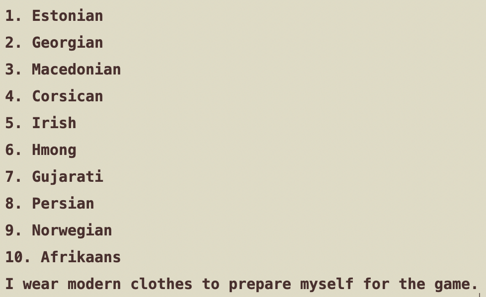
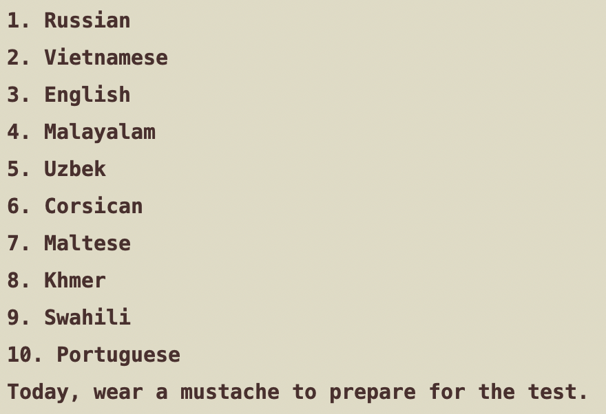
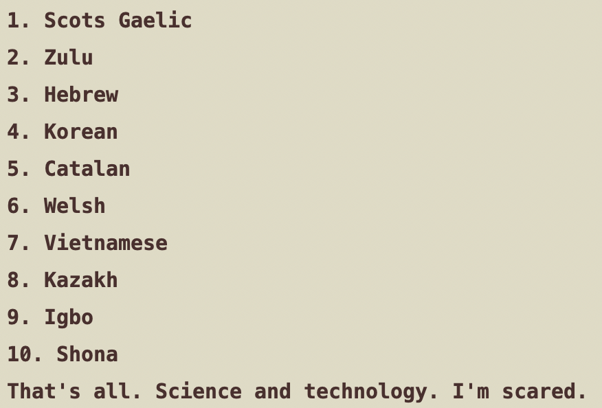

Google ***\"Translate\"***
=======

Takes your perfectly good input and spices it up using multiple random layers of Google Translate!

Provide an `INPUT` in `translate.py`, the number of languages (`LAYERS`) to subject it to, and then feast your eyes!

Its wondrous what Google Translate can come up with:

`'Art doesnt have to be intentional.'`
 
--> </img>

You won't ever need another inspirational quote generator.

`'One small action would change her life, but whether it would be for better or for worse was yet to be determined.`
 
--> </img>

Sometimes, the meaning is retained, and is even distilled:

`'Each person who knows you has a different perception of who you are.'`
 
--> </img>

Let's get mythical:

`'Today I dressed my unicorn up in preparation for the race.'`
 
--> </img>

Often, the same input will yield many different results each time you run, because the languages chosen are randomized!

`'Today I dressed my unicorn up in preparation for the race.'`
 
--> </img>

Google Translate can also give you opinions on slogans:

`'People. Technology. Awesome'`
 
--> </img>

 - Created for the Harvard Computer Society's web scraping project
